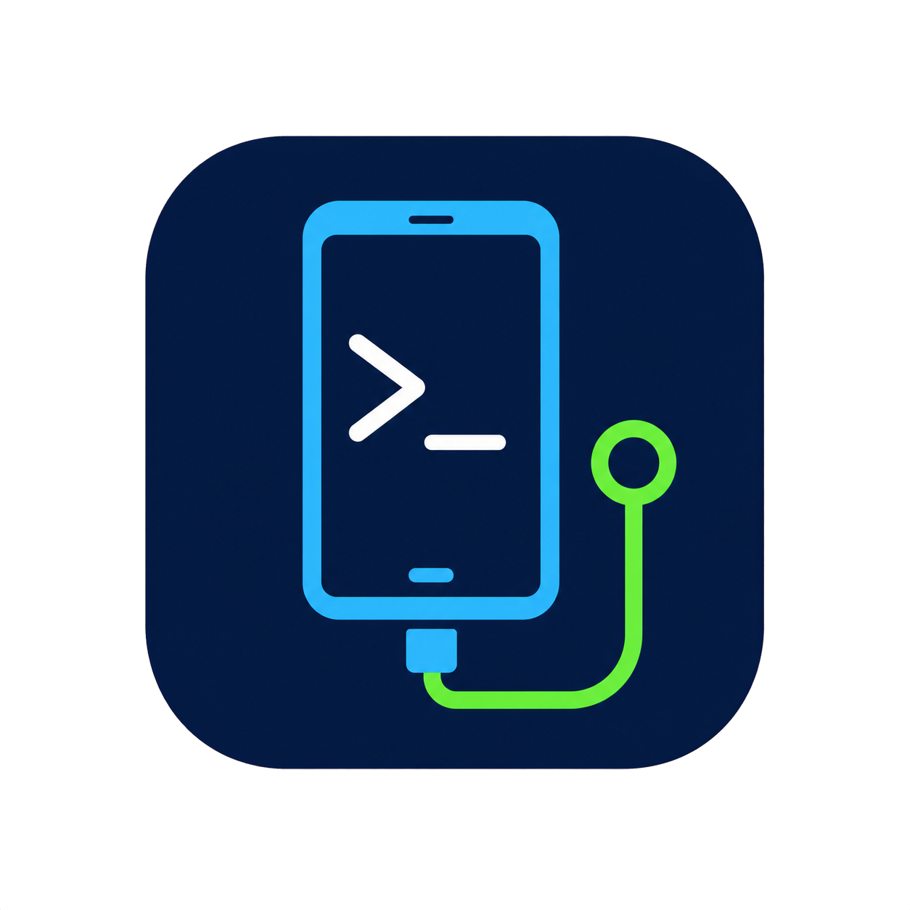

# Android ADB Quick Tools

[繁體中文](README.md) · [English](README.en.md)

<p align="center">
  
</p>

A portable Windows GUI for ADB that helps users verify Android device connections, install APKs in batches, adjust common device settings, capture screenshots, and back up phone photos.

Current version: **v1.15.6**

## Features

- Detects `adb.exe` and reports connected, offline, and unauthorized devices.
- Supports USB debugging and Wi-Fi wireless debugging, with built-in connection instructions.
- Creates multiple reusable APK groups and installs every APK sequentially with per-file status reporting.
- Scans subfolders under the local `APKs` directory and exposes them as protected, folder-synchronized groups.
- Adds APKs to a group by drag and drop, or immediately installs one or more dropped APK files.
- Reads and adjusts device brightness using a slider, numeric input, `+` / `-` keys, or the mouse wheel.
- Controls auto brightness, 10-minute screen timeout, maximum timeout, and stay-awake-while-charging independently.
- Applies and verifies each quick setting separately, so one failure does not stop the remaining settings.
- Sets media volume to minimum or maximum, opens a URL on the phone, and saves a phone screenshot as PNG.
- Downloads files from `DCIM`, `Pictures`, and `Picture`, preserves their directory structure, and creates a ZIP archive.
- Reads remote file sizes before transfer and can skip individual files above a configurable limit (2 GB by default).
- Supports Per-Monitor V2 high DPI, remembered window dimensions, and 4K display scaling.

## Requirements

- Windows 10 or Windows 11
- .NET Framework 4.8
- `adb.exe` from Android Platform Tools
- Developer options plus USB debugging or wireless debugging enabled on the Android device

## Get Android SDK Platform-Tools

Google distributes `adb.exe` as part of Android SDK Platform-Tools:

- Official download page: [SDK Platform-Tools release notes](https://developer.android.com/tools/releases/platform-tools)
- On that page, choose **Download SDK Platform-Tools for Windows**, accept the terms, and download the ZIP archive.
- Extract the archive. `adb.exe` is inside the `platform-tools` folder; click **Select adb.exe** in this application and choose that file.
- If Android Studio is already installed, Platform-Tools can also be installed or updated through **SDK Manager > SDK Tools > Android SDK Platform-Tools**. The application normally detects the default SDK location automatically.

Use the latest version from the official page. Google states that current Platform-Tools releases are backward compatible with older Android versions, so a separate legacy ADB download is normally unnecessary.

## Download and Use

1. Download the latest `AndroidADBTools.exe` or full ZIP package from [Releases](https://github.com/ahui3c/AndroidADBTools/releases).
2. Run `AndroidADBTools.exe`.
3. If ADB is not detected automatically, click **Select adb.exe** and choose `platform-tools\adb.exe` from the Android SDK.
4. Connect and authorize the phone, then click **Check again**.

The app searches the saved ADB path, its own folder, `platform-tools`, the default Android SDK location, and the system `PATH`.

## Folder-Synchronized APK Groups

Create folders next to the application using this structure:

```text
APKs/
├─ Common Tools/
│  ├─ app1.apk
│  └─ app2.apk
└─ Test Apps/
   └─ test.apk
```

Each direct child folder becomes an installation group when the app starts. APK contents are refreshed whenever the group is selected. These groups use a folder icon and are managed directly through the file system.

## Phone Data Download

- Scans `/sdcard/DCIM`, `/sdcard/Pictures`, and `/sdcard/Picture`.
- Creates a path-and-size manifest on the phone before deciding which files to transfer.
- Names archives as `DeviceModel_yyyyMMdd-HHmmss.zip`.
- The size filter applies to each individual file, not the total archive size.
- Both USB and Wi-Fi ADB work; USB is recommended for large backups.

## Build from Source

Run the following command in PowerShell:

```powershell
powershell -ExecutionPolicy Bypass -File .\Build.ps1
```

The executable is written to `dist\AndroidADBTools.exe`. The build script uses the .NET Framework C# compiler included with Windows, so the .NET SDK is not required.

## Settings Location

User settings are stored in:

```text
%LOCALAPPDATA%\AndroidADBTools\settings.json
```

This includes the ADB path, APK groups and order, window dimensions, download destination, and file-size filtering preference.

## Author

- Liao Ah-Hui (廖阿輝)
- Email: [chehui@gmail.com](mailto:chehui@gmail.com)
- Website: [https://ahui3c.com](https://ahui3c.com)
