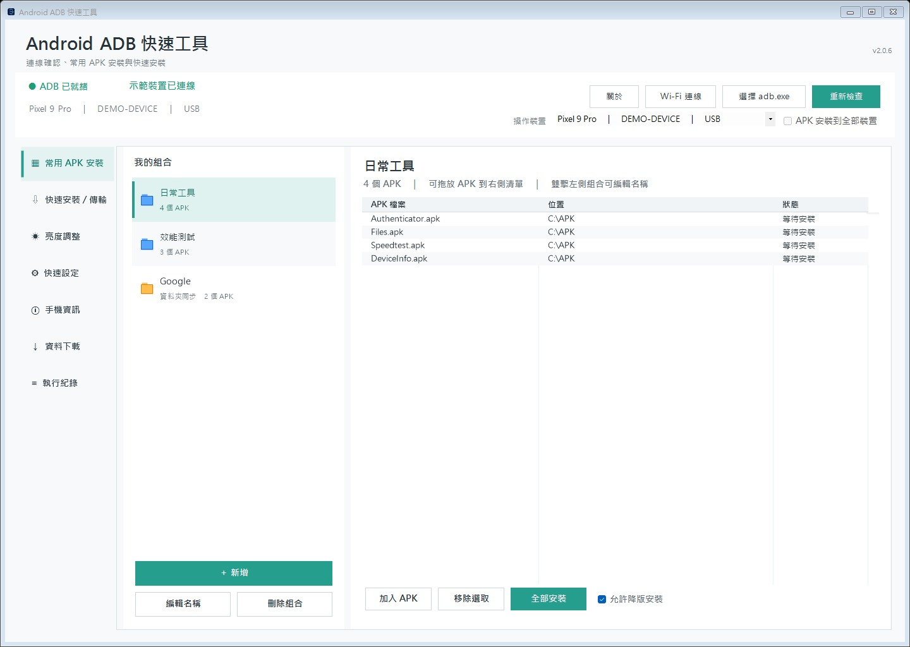
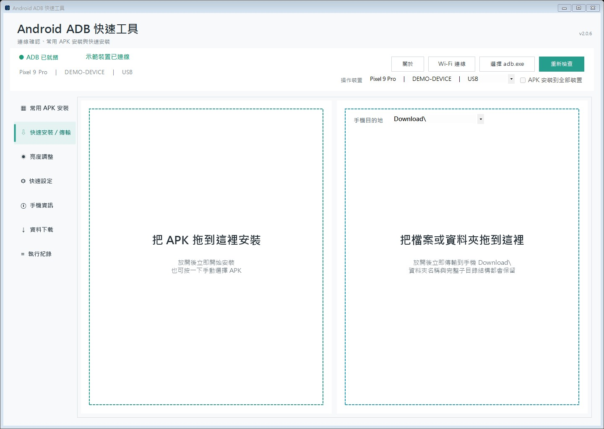
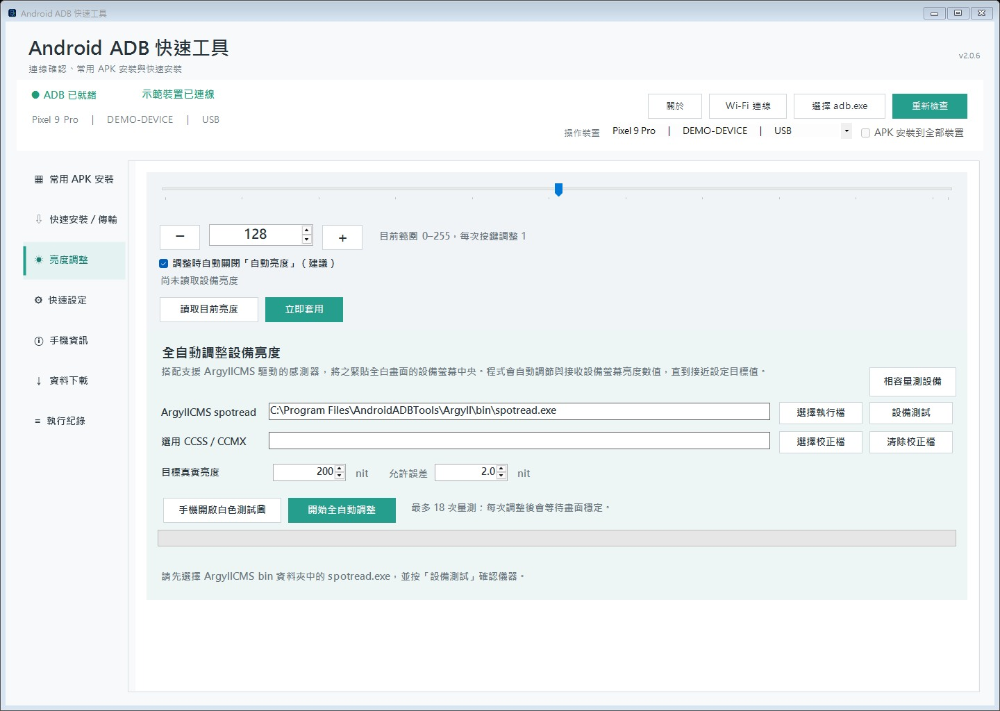
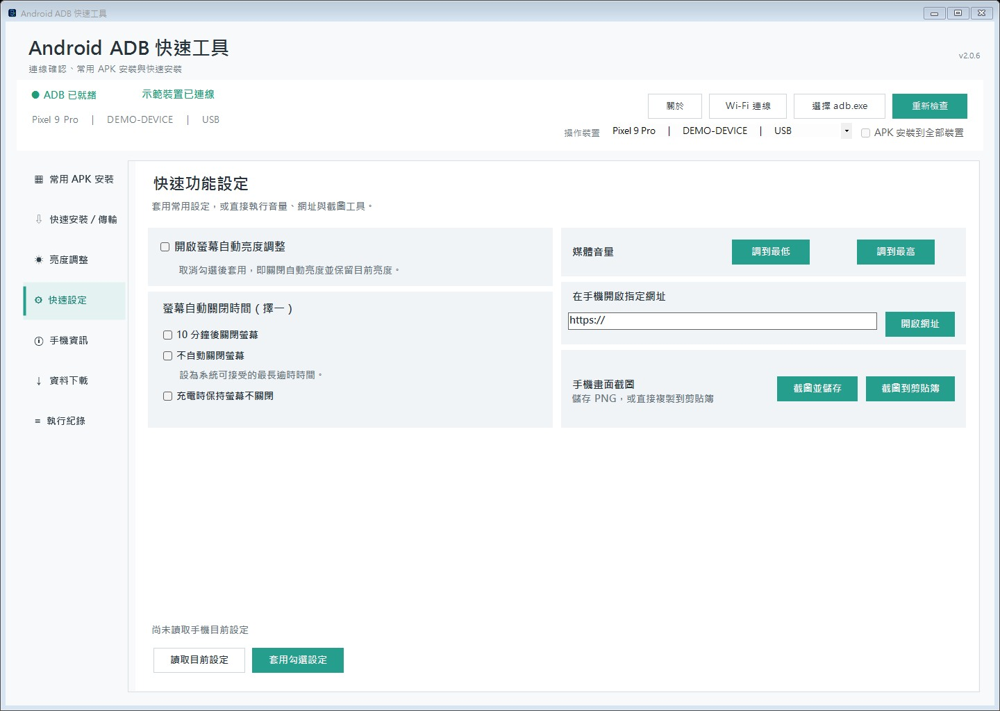
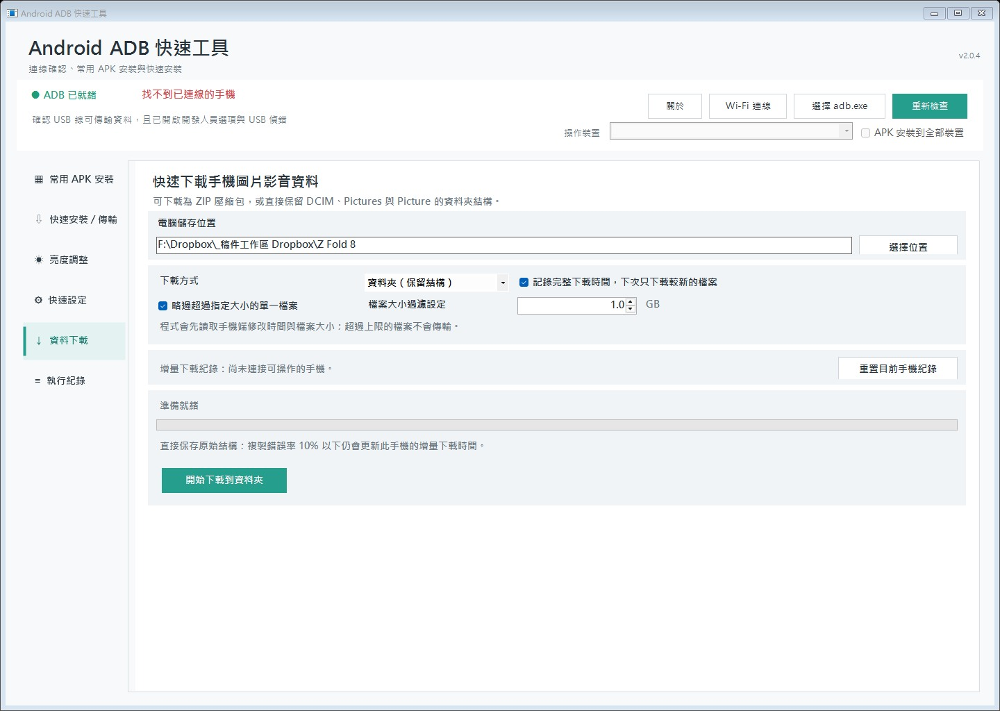

# Android ADB Quick Tools

[繁體中文](README.md) · [English](README.en.md)

<p align="center">
  
</p>

<p align="center">
  <a href="LICENSE"></a>
</p>

A portable Windows GUI for ADB that helps users verify Android device connections, install APKs in batches, adjust common device settings, capture screenshots, and back up phone photos.

Current version: **v2.0.2**

[View the complete changelog](CHANGELOG.md)

## Features

- Detects `adb.exe` and reports connected, offline, and unauthorized devices.
- Includes a Wi-Fi debugging manager for pairing, connecting, and disconnecting with the phone IP, pairing port, six-digit code, and debugging port.
- Saves paired-device records, supports automatic reconnection at startup, discovers LAN devices through mDNS, and checks ADB version compatibility.
- Supports multiple connected devices with model, serial, and USB/Wi-Fi labels, remembers the last primary device, and can install APKs to every connected device.
- Creates multiple reusable APK groups and installs every APK sequentially with per-file status reporting.
- Hover over an APK list item to view its complete file name and full path when columns are truncated.
- Reorders groups by drag and drop; custom groups can be renamed by double-clicking, and the order is saved automatically.
- Scans subfolders under the local `APKs` directory and exposes them as protected, folder-synchronized groups.
- The split **Quick Install / Transfer** page installs dropped APKs on the left. On the right, choose `Download`, `DCIM`, `Pictures`, or the shared-storage root before dropping files or folders; directory structure is preserved.
- Reads and adjusts device brightness using a slider, numeric input, or the `+` / `-` keys.
- Adds automatic brightness adjustment using measured luminance with ArgyllCMS `spotread` and an external colorimeter. A closed loop repeatedly measures and adjusts Android brightness while the original manual controls remain available.
- Controls auto brightness, 10-minute screen timeout, maximum timeout, and stay-awake-while-charging independently.
- Applies and verifies each quick setting separately, so one failure does not stop the remaining settings.
- Sets media volume to minimum or maximum, opens a URL on the phone, and saves a phone screenshot as PNG.
- Downloads files from `DCIM`, `Pictures`, and `Picture`, preserves their directory structure, and creates a ZIP archive.
- Reads remote file sizes before transfer and can skip individual files above a configurable limit (2 GB by default).
- Supports Per-Monitor V2 high DPI, remembered window dimensions, and 4K display scaling.

## Screenshots

<table>
  <tr>
    <td colspan="2"><br><sub>Reusable APK groups and batch installation</sub></td>
  </tr>
  <tr>
    <td width="50%"><br><sub>Drag and drop APKs, files, and folders</sub></td>
    <td width="50%"><br><sub>Manual and automatic device brightness adjustment</sub></td>
  </tr>
  <tr>
    <td width="67%"><br><sub>Brightness, display, volume, URL, and screenshot controls</sub></td>
    <td width="33%"><br><sub>Download and back up phone photos and videos</sub></td>
  </tr>
</table>

## Requirements

- Windows 10 or Windows 11
- .NET Framework 4.8
- `adb.exe` from Android Platform Tools (included in the Complete package)
- Developer options plus USB debugging or wireless debugging enabled on the Android device

## Wi-Fi Pairing and Compatibility

Click **Wi-Fi Connection** on the main screen to manage wireless debugging directly:

> **Validation status:** Wi-Fi pairing, mDNS discovery, automatic reconnection, and multi-device behavior have not yet been verified across a sufficiently broad range of devices and networks. Treat them as testing-stage features. Availability depends on the Android version, OEM customization, ADB version, router client isolation, and firewall settings; keep USB debugging available as a fallback.

1. On Android 11 (API 30) or later, open **Developer options > Wireless debugging > Pair device with pairing code**. Enter the displayed IP address, pairing port, and six-digit code, then click **Start pairing**.
2. Return to the main Wireless debugging screen and enter the debugging connection port shown under **IP address & port**, then connect. The debugging port is normally different from the pairing port.
3. mDNS discovery lists pairing and debugging services on the local network; double-click a result to fill the matching fields.
4. The app can save device records and reconnect them at startup. Update the debugging port if Android generates a new one.

Pairing-code support requires an ADB release with `adb pair`; Platform Tools 30.0.0 or later is recommended, and the latest official release is preferred. Android 10 (API 29) and earlier do not provide the built-in pairing-code workflow: authorize over USB first, switch ADB to `tcpip 5555`, and then connect wirelessly. The computer and phone must be on the same mutually reachable network. Guest Wi-Fi, client isolation, enterprise firewalls, or OEM restrictions can prevent mDNS discovery or wireless connections.

## Get Android SDK Platform-Tools

Google distributes `adb.exe` as part of Android SDK Platform-Tools:

- Official download page: [SDK Platform-Tools release notes](https://developer.android.com/tools/releases/platform-tools)
- On that page, choose **Download SDK Platform-Tools for Windows**, accept the terms, and download the ZIP archive.
- Extract the archive. `adb.exe` is inside the `platform-tools` folder; click **Select adb.exe** in this application and choose that file.
- If Android Studio is already installed, Platform-Tools can also be installed or updated through **SDK Manager > SDK Tools > Android SDK Platform-Tools**. The application normally detects the default SDK location automatically.

Use the latest version from the official page. Google states that current Platform-Tools releases are backward compatible with older Android versions, so a separate legacy ADB download is normally unnecessary.

## Download and Use

Each GitHub Release provides two archives:

- `AndroidADBTools-v2.0.2.zip`: the standard package containing AndroidADBTools only, intended for users who already have Android Platform-Tools or prefer to manage tool versions themselves.
- `AndroidADBTools-v2.0.2-complete.zip`: the Complete package, additionally containing Android ADB 37.0.0 and ArgyllCMS 3.5.0 `spotread.exe`. Both tools are detected automatically after extraction.

1. Choose the ZIP you need from [Releases](https://github.com/ahui3c/AndroidADBTools/releases) and extract the entire archive.
2. Run `AndroidADBTools.exe`.
3. With the standard package, if ADB is not detected automatically, click **Select adb.exe** and choose the Android SDK's `platform-tools\adb.exe`.
4. Connect and authorize the phone, then click **Check again**.

The app searches the saved ADB path, its own folder, `ADBtools\adb.exe`, `platform-tools\adb.exe`, the default Android SDK location, and the system `PATH`. If `spotread.exe` has not been selected, it also detects the Complete package's bundled `Argyll\bin\spotread.exe` and fills in the setting automatically.

## Folder-Synchronized APK Groups

Create folders next to the application using this structure:

```text
APKs/
├─ Common Tools/
│  ├─ app1.apk
│  └─ app2.apk
└─ Test Apps/
   └─ test.apk
```

Each direct child folder becomes an installation group when the app starts. APK contents are refreshed whenever the group is selected. These groups use a folder icon and are managed directly through the file system.

## Phone Data Download

- Scans `/sdcard/DCIM`, `/sdcard/Pictures`, and `/sdcard/Picture`.
- Creates a path-and-size manifest on the phone before deciding which files to transfer.
- Names archives as `DeviceModel_yyyyMMdd-HHmmss.zip`.
- The size filter applies to each individual file, not the total archive size.
- Both USB and Wi-Fi ADB work; USB is recommended for large backups.

## Quick Transfer to the Device

- Open **Quick Install / Transfer** and drop files or folders on the right-hand transfer area.
- Select the device destination first. The default is `/sdcard/Download/`; `/sdcard/DCIM/`, `/sdcard/Pictures/`, and the shared-storage root `/sdcard/` are also available.
- Dropped items are immediately sent to the selected destination.
- Dropped folders retain their top-level folder name and complete subdirectory structure.
- Each dropped item is processed independently; one failure does not stop the remaining transfers, and details are written to the execution log.

## Automatic Brightness Adjustment Using Measured Luminance

The upper part of the **Brightness** page retains all manual controls. The lower part adds closed-loop calibration with an external colorimeter:

1. The Complete package includes ArgyllCMS 3.5.0 `spotread.exe`. With the standard package, download the Windows build from the [official ArgyllCMS website](https://www.argyllcms.com/) and select `bin\spotread.exe` in the application.
2. Connect the phone and an ArgyllCMS-compatible display measurement instrument, then place its sensor flat against the center of the display.
3. Open the white test image on the phone and make sure it is truly full-screen, with no viewer controls or notifications covering it.
4. Run **Device test** first. Once an absolute emissive Y reading is available, enter the target (for example, 200 nit) and tolerance, then start automatic adjustment.
5. The app disables Android auto brightness and repeatedly changes brightness, waits for stabilization, and runs `spotread -e -O`. It keeps the Android value whose measured luminance is closest to the target.

An optional `.ccss` or `.ccmx` display correction can reduce meter/display spectral mismatch, especially with OLED panels. This feature controls measured white luminance only; it is not a complete color/ICC calibration and cannot enable HDR or OEM high-brightness modes. If the target is outside the phone's current range, the closest measured result is retained and reported.

### spotread-Compatible Measurement Instruments

The following are common display-measurement families from the official ArgyllCMS list; this is not an exhaustive list:

| Brand/type | Common compatible models |
| --- | --- |
| Calibrite/X-Rite colorimeters | ColorChecker Display/Pro/Plus, i1Display Pro/Pro Plus, ColorMunki Display, i1Display Studio |
| X-Rite spectrometers | ColorMunki Design/Photo, i1Studio, ColorChecker Studio, i1Pro2, i1Pro3/Pro3 Plus |
| Datacolor | Spyder 3/4/5, SpyderX, SpyderX2, Spyder/SpyderPRO (2024) |
| Professional and other instruments | Klein K10-A, JETI specbos/spectraval, ColorHug/ColorHug2, DTP94, Eye-One Display, Huey, HCFR |

Select **Compatible instruments** in the application for a summary. See the [complete official ArgyllCMS instrument list](https://www.argyllcms.com/doc/instruments.html) and [Windows instrument installation guide](https://www.argyllcms.com/doc/Installing_MSWindows.html) for model-specific capabilities and setup. Some instruments require vendor firmware, calibration data, or an additional driver. The authoritative check is whether **Device test** lets `spotread` identify the instrument and return a reading. If detection fails, close calibration or RGB-lighting software that may own the device, then check the driver and USB connection.

## Build from Source

Run the following command in PowerShell:

```powershell
powershell -ExecutionPolicy Bypass -File .\Build.ps1
```

The executable is written to `dist\AndroidADBTools.exe`. The build script uses the .NET Framework C# compiler included with Windows, so the .NET SDK is not required.

## Settings Location

User settings are stored in:

```text
%LOCALAPPDATA%\AndroidADBTools\settings.json
```

This includes the ADB path, last primary device, saved Wi-Fi devices and auto-reconnect preference, install-to-all-devices preference, APK groups and order, window dimensions, download destination, file-size filtering preference, `spotread` and correction paths, target nit, and tolerance.

## License

Starting with **v1.16.0**, this project is licensed under the [GNU Affero General Public License v3.0](LICENSE), SPDX identifier `AGPL-3.0-only`. You may use, study, modify, and redistribute the software, subject to the source-code and other obligations in the license when conveying modified versions or providing versions covered by AGPL's remote-network interaction terms.

Previously released **v1.15.6 and earlier versions remain under their original MIT License**. This change does not revoke rights already granted for those releases. The former MIT text is preserved in [LICENSE-MIT-LEGACY](LICENSE-MIT-LEGACY) for historical reference only.

This program is provided as-is, without any warranty. See [LICENSE](LICENSE) for the complete terms.

The Complete package additionally contains Android ADB components under Apache License 2.0 and ArgyllCMS `spotread.exe` under GNU AGPLv3. See [THIRD_PARTY_NOTICES.md](THIRD_PARTY_NOTICES.md) for versions, upstream sources, license notices, and corresponding-source information. The standard package does not contain these third-party executables.

## Author

- Liao Ah-Hui (廖阿輝)
- Email: [chehui@gmail.com](mailto:chehui@gmail.com)
- Website: [https://ahui3c.com](https://ahui3c.com)
