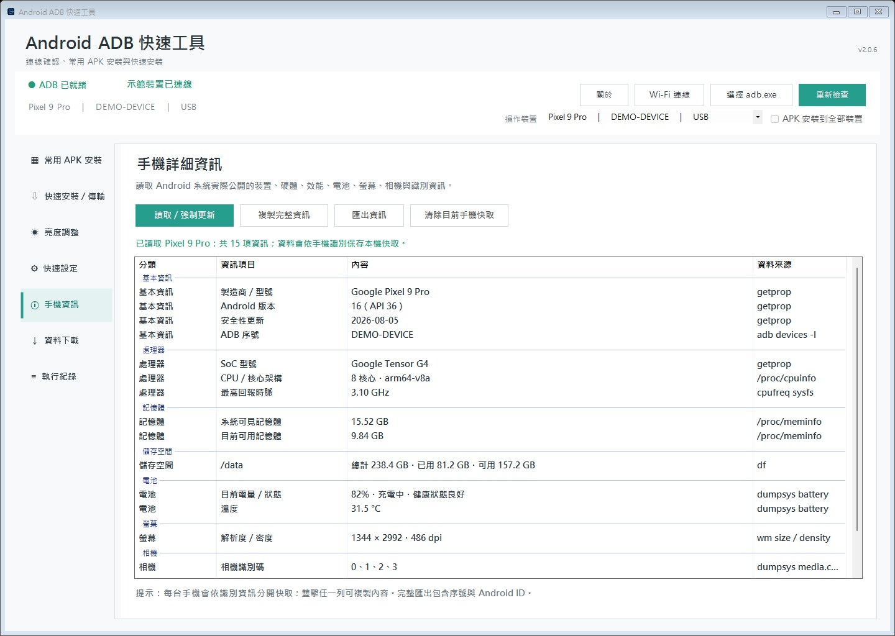
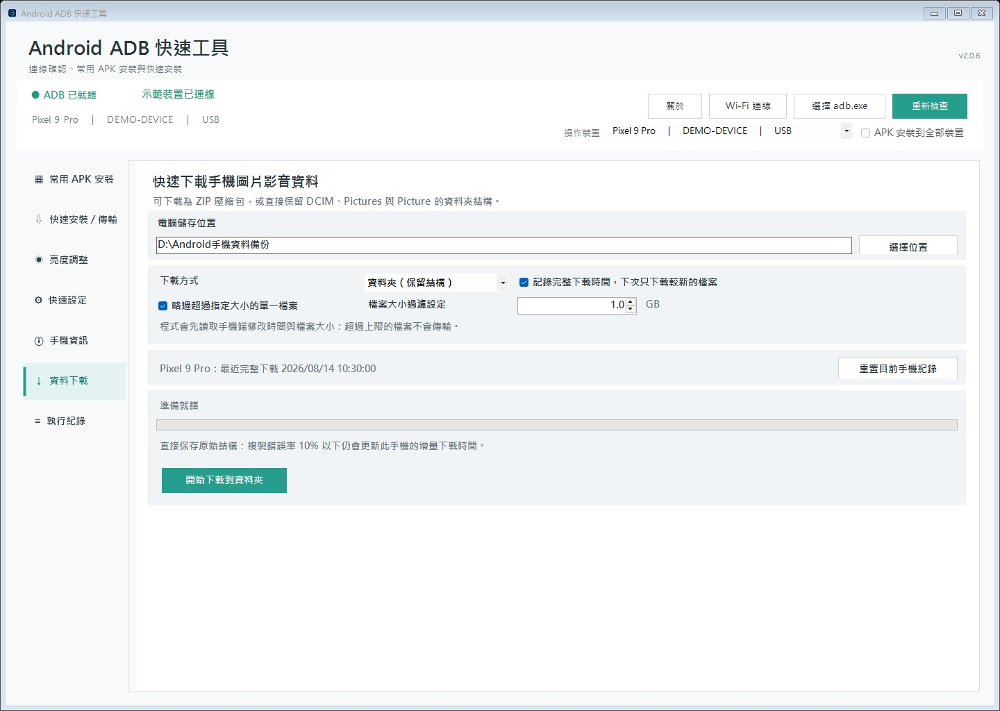
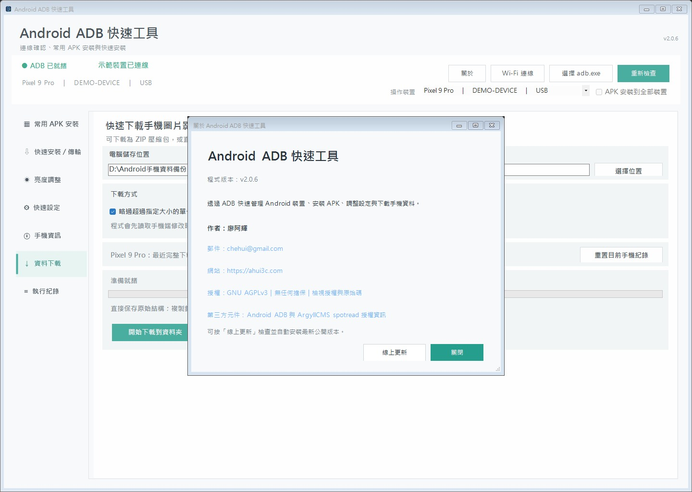

# Android ADB 快速工具

[繁體中文](README.md) · [English](README.en.md)

<p align="center">
  
</p>

<p align="center">
  <a href="LICENSE"></a>
  <a href="https://github.com/ahui3c/AndroidADBTools/releases/latest"></a>
  <a href="https://github.com/ahui3c/AndroidADBTools/releases/latest"></a>
</p>

一套可使用免安裝可攜式版本或完整安裝版的 Windows 圖形化 ADB 工具，協助使用者快速確認 Android 裝置連線、批次安裝 APK、調整常用系統設定、擷取畫面與備份手機相片資料。

目前版本：**v2.0.8**

[查看完整更新紀錄](CHANGELOG.md)

> v2.0.8 新增手機程式管理、阿輝自家工具下載更新、連線等待與 ADB 自動換埠，並優化亮度校正、依手機保存與快速套用結果。提供標準可攜式版、Complete 可攜式版與 Complete 完整安裝版；可在「關於」進行線上更新。

## 主要功能

- 檢查 `adb.exe`、USB 偵錯授權、離線與未授權狀態。
- 內建 Wi-Fi 無線偵錯管理，可直接輸入手機 IP、配對 Port、六位數配對碼與偵錯 Port 完成配對、連線及中斷。
- 保存已配對裝置紀錄，支援啟動時自動重新連線、mDNS 區域網路搜尋，以及 ADB 版本與相容性檢查。
- 支援多裝置選擇，顯示型號、序號及 USB／Wi-Fi 標記並記住上次選擇；APK 可同時安裝到全部已連線裝置。
- 「程式管理」可掃描目前手機中由使用者安裝的應用程式，直接顯示手機系統提供的易懂程式名稱，依程式名稱、套件名稱或安裝來源搜尋、點擊欄位標題切換正向／逆向排序，並勾選多個項目一次批次移除；也可隱藏經 Android 或裝置管理政策確認無法移除的程式。
- 「手機資訊」可讀取型號、處理器／SoC、核心與 ABI、記憶體、儲存空間、電池、螢幕、相機、Android 版本、安全性更新、序號及主要硬體功能，並標示每項資料來源。
- 手機資訊支援一鍵複製完整摘要、雙擊複製單項內容，以及匯出 UTF-8 文字檔、Excel `.xlsx` 或 JSON；Excel 匯出不需要預先安裝 Microsoft Excel。Android 未公開的規格會明確標示而不使用推測值。
- 手機資訊讀取後會依裝置識別保存本機快取；同一台手機再次連接或在多台手機之間切換時會自動帶入，並可強制更新或只清除目前手機的快取。
- 「關於」頁面提供一鍵線上更新：自動下載並驗證 GitHub 最新公開版本、替換目前程式後重新啟動；安裝位置需要系統管理員權限時會顯示 Windows UAC 授權畫面。
- 可選擇免安裝可攜式版本，或使用內含 ADB、`spotread.exe`、開始功能表捷徑與解除安裝功能的 Complete 安裝版。
- 內建「阿輝自家工具」，可直接檢查、下載與安裝 TestTools Android、PowerTesting Web、PowerTesting Monitor 的最新 GitHub 正式版 APK；再次操作會自動檢查線上更新。
- 建立多組「常用 APK／XAPK 安裝」清單，一鍵依序安裝並顯示每個套件的結果。
- 支援標準 APK 與 XAPK；XAPK 會自動安裝 base／split APK，並將封包內的 `Android/obb` 資料傳輸到正確位置。
- 安裝清單欄位過長時，可將滑鼠移到項目上查看完整檔名與完整位置。
- 「我的組合」支援拖曳排序；自訂組合可雙擊直接編輯名稱，排序會自動保存。
- 自建組合內的 APK／XAPK 也可拖曳調整順序；項目右鍵可單獨快速安裝或從清單移除。
- 自動掃描程式旁 `APKs` 目錄中的子資料夾，建立不可誤刪的同步安裝組合。
- 資料夾同步組合維持唯讀，項目右鍵仍可單獨快速安裝，介面不顯示無效的移除操作。
- 「常用程式安裝」及「快速傳輸安裝」在實際安裝或傳輸前會即時確認手機連線；未就緒時顯示可中止的等待視窗，連線並完成偵錯授權後自動繼續原本操作。
- 若 Windows 保留或禁止 ADB 預設使用的 TCP 5037，程式會自動選擇其他可用連接埠並讓所有 ADB 功能共用；介面會顯示實際連接埠與較明確的失敗原因。
- 「快速安裝 / 傳輸」提供左右雙拖曳區：左側拖入 APK 或 XAPK 立即安裝；右側可選 `Download`、`DCIM`、`Pictures` 或內部儲存根目錄，再拖入檔案或資料夾並保留完整結構。
- 讀取與即時調整手機亮度，支援滑桿、數值及 `+`／`-` 鍵。
- 新增實測自動調整亮度功能：搭配 ArgyllCMS `spotread` 與外接色度計，以閉迴路反覆量測並調整 Android 亮度至目標值；原有手動模式完整保留。
- 快速設定自動亮度、10 分鐘關屏、最長關屏時間及充電時保持螢幕開啟。
- 各項快速設定獨立執行並讀回驗證；單項失敗不影響其他設定。
- 媒體音量可快速調到最低、50% 或最高；50% 會依手機實際音量範圍計算並讀回確認。另可在手機開啟網址，手機截圖可儲存為 PNG 或直接複製到 Windows 剪貼簿。
- 下載手機 `DCIM`、`Pictures`、`Picture` 內的檔案，可建立 ZIP 壓縮包或直接保留原始資料夾結構。
- 資料夾模式可依手機分別記錄上次完整下載時間，後續只傳輸新增或修改的檔案，並可手動重置紀錄。
- 下載前先取得檔案大小，可略過超過自訂上限的單一檔案（預設 2 GB）。
- 掃描及下載時會直接忽略 Android 的 `.thumbnails` 縮圖快取資料夾，不列入錯誤或下載統計。
- 支援 Per-Monitor V2 高 DPI、視窗大小記憶與 4K 顯示器縮放。

## 軟體畫面

<table>
  <tr>
    <td colspan="2"><br><sub>常用 APK 組合、自建／資料夾同步分類與批次安裝</sub></td>
  </tr>
  <tr>
    <td width="50%"><br><sub>拖放 APK、檔案與資料夾，並選擇手機目的地</sub></td>
    <td width="50%"><br><sub>手動亮度控制與 ArgyllCMS 實測自動調整</sub></td>
  </tr>
  <tr>
    <td width="50%"><br><sub>顯示、音量、網址與截圖到剪貼簿</sub></td>
    <td width="50%"><br><sub>手機硬體與系統資訊、快取、複製及匯出</sub></td>
  </tr>
  <tr>
    <td width="50%"><br><sub>ZIP／原始資料夾下載與分手機增量時間紀錄</sub></td>
    <td width="50%"><br><sub>關於頁面的一鍵線上更新</sub></td>
  </tr>
</table>

## 系統需求

- Windows 10 或 Windows 11
- .NET Framework 4.8
- Android Platform Tools 中的 `adb.exe`（Complete 版已內附）
- 手機已開啟「開發人員選項」及「USB 偵錯」或「無線偵錯」

## Wi-Fi 配對與相容性

按主畫面的「Wi-Fi 連線」即可直接管理無線偵錯：

> **驗證狀態：** Wi-Fi 配對、mDNS 搜尋、自動重新連線及多裝置環境尚未完成足夠機型與網路環境的實機驗證，請視為測試中功能。實際可用性會受 Android 版本、廠牌客製系統、ADB 版本、路由器用戶端隔離及防火牆影響；使用前建議保留 USB 偵錯作為備援。

1. Android 11（API 30）以上：在手機的「開發人員選項 > 無線偵錯」選擇使用配對碼配對，將手機顯示的 IP、配對 Port 與六位數配對碼輸入程式並按「開始配對」。
2. 回到手機的無線偵錯主畫面，將「IP 位址與連接埠」中的偵錯 Port 輸入程式，再按「連線」。偵錯 Port 通常與配對 Port 不同。
3. mDNS 搜尋可列出區域網路上的配對與偵錯服務；雙擊搜尋結果可自動帶入對應欄位。
4. 程式可保存裝置紀錄並在下次啟動時執行自動重新連線；若手機重新產生 Port，請更新偵錯 Port。

配對碼功能建議使用最新版 Android SDK Platform-Tools，最低需支援 `adb pair` 的 Platform Tools 30.0.0。Android 10（API 29）以下沒有系統內建配對碼流程，必須先使用 USB 完成偵錯授權，再切換到 `adb tcpip 5555` 後連線。電腦與手機需要位於可互通的同一網路；訪客 Wi-Fi、用戶端隔離、企業防火牆或部分廠牌的系統限制可能讓 mDNS 搜尋或無線連線失敗。

## 取得 Android SDK Platform-Tools

`adb.exe` 包含在 Google 官方的 Android SDK Platform-Tools 中：

- 官方下載頁：[SDK Platform-Tools release notes](https://developer.android.com/tools/releases/platform-tools)
- 進入頁面後選擇 **Download SDK Platform-Tools for Windows**，閱讀並同意條款後下載 ZIP。
- 解壓縮後，`adb.exe` 位於 `platform-tools` 資料夾內；在本工具按「選擇 adb.exe」並指定該檔案即可。
- 若已安裝 Android Studio，也可透過 **SDK Manager > SDK Tools > Android SDK Platform-Tools** 安裝或更新；程式通常會自動找到預設 SDK 位置。

建議使用官方頁面提供的最新版本。Google 表示 Platform-Tools 向下相容舊版 Android，因此一般不需要另外尋找舊版 ADB。

## 下載與使用

GitHub Release 同時提供可攜式版本與完整安裝版：

- `AndroidADBTools-v2.0.8.zip`：標準可攜式版，只包含 AndroidADBTools；適合已安裝 Android Platform-Tools 或希望自行管理工具版本的使用者。
- `AndroidADBTools-v2.0.8-complete.zip`：Complete 可攜式版，額外內含 Android ADB 37.0.0 與 ArgyllCMS 3.5.0 `spotread.exe`，解壓縮後會自動偵測，不必另外指定。
- `AndroidADBTools-v2.0.8-complete-setup.exe`：完整安裝版，包含與 Complete 可攜式版相同的工具，會安裝到 Program Files，提供開始功能表、選配桌面捷徑與解除安裝功能。

1. 到 [Releases](https://github.com/ahui3c/AndroidADBTools/releases) 選擇需要的版本。可攜式版請完整解壓縮；安裝版直接執行 Setup 並接受 Windows UAC 授權。
2. 可攜式版執行 `AndroidADBTools.exe`；安裝版可從開始功能表啟動。
3. 使用標準版且程式沒有找到 ADB 時，按「選擇 adb.exe」並指定 Android SDK 的 `platform-tools\adb.exe`。
4. 連接並授權手機後按「重新檢查」。

程式會依序搜尋：已儲存路徑、程式旁的 `adb.exe`、`ADBtools\adb.exe`、`platform-tools\adb.exe`、Android SDK 預設位置及系統 `PATH`。尚未指定 `spotread.exe` 時，也會自動搜尋 Complete 版內附的 `Argyll\bin\spotread.exe` 並填入設定。

## APK／XAPK 安裝與資料夾同步

「阿輝自家工具」固定顯示在常用程式安裝清單最上方，來源為下列 ahui3c GitHub 專案的最新正式 Release：

- [TestTools Android](https://github.com/ahui3c/TestTools_Android)
- [PowerTesting Web](https://github.com/ahui3c/powertesting-web-Android)
- [PowerTesting Monitor](https://github.com/ahui3c/powertesting-monitor-Android)

每個程式都會直接顯示繁體中文用途說明。下載與安裝是兩個獨立動作：「下載／更新選取」只會檢查 GitHub 最新正式版、下載 APK 到 `%LocalAppData%\AndroidADBTools\ahui-tools`，並核對檔案大小與 SHA-256；「安裝選取」與右鍵「安裝已下載版本」只會將本機已有的 APK 交給 ADB，不會自行連線下載。程式安裝在 Program Files 時也不需要為 APK 快取取得 UAC 權限。

執行安裝前會重新檢查目前的 ADB 連線。若手機尚未接上、離線或等待 USB 偵錯授權，程式會顯示等待視窗並每 2 秒重新檢查；完成連線後自動開始安裝，也可按「中止本次操作」取消。下載／更新 APK 本身不需要手機連線。

- **TestTools Android**：整合測試連結、亮度測試、快速截圖、影音備份與手機資訊的手機測試工具箱。
- **PowerTesting Web**：自動模擬網頁瀏覽，依照設定時間記錄手機電量消耗。
- **PowerTesting Monitor**：以浮動視窗監控各種測試情境耗電，保存電量變化與測試紀錄。

可在程式旁建立以下結構：

```text
APKs/
├─ 常用工具/
│  ├─ app1.apk
│  └─ game.xapk
└─ 測試程式/
   └─ test.apk
```

程式啟動時會將每個子資料夾建立為一個安裝組合；點選時會重新掃描 APK 與 XAPK 內容。資料夾同步組合會以資料夾圖示標示，名稱與內容直接由檔案系統管理。

XAPK 是包含一個或多個 APK 的壓縮封包。程式會先檢查封包路徑與解壓大小，單一 APK 使用 ADB `install`，多個 base／split APK 使用 `install-multiple` 一次安裝。封包若包含 `Android/obb/<套件名稱>/`，安裝成功後會自動傳輸到手機的 `/sdcard/Android/obb/`；若手機系統或廠牌限制該位置的寫入，會將其列為安裝失敗並在「執行紀錄」顯示原因。

## 手機資料下載

- 掃描 `/sdcard/DCIM`、`/sdcard/Pictures` 與 `/sdcard/Picture`。
- 在手機端先建立修改時間、路徑與大小清單，再依設定決定是否傳輸。
- **ZIP 壓縮包**：每次完整下載，名稱格式為 `手機型號_yyyyMMdd-HHmmss.zip`。
- **資料夾（保留結構）**：直接在選定的電腦儲存位置建立 `DCIM`、`Pictures`、`Picture` 等原始目錄，不額外建立手機名稱資料夾，也不進行壓縮。
- 資料夾模式預設啟用增量紀錄；同一手機、同一電腦目的地下次只下載上次完整成功後新增或修改的檔案。
- 不同手機的紀錄彼此獨立；變更電腦目的地會視為首次下載，也可按「重置目前手機紀錄」強制重新完整下載。
- 依大小限制正常略過的檔案不列入錯誤率。實際複製的檔案錯誤率在 10% 以下（含 10%）仍視為成功並更新完整下載時間；超過 10% 時不更新，程式會顯示警告訊息。
- 大小上限是針對「單一檔案」，不是整個備份的總大小。
- USB 與 Wi-Fi ADB 皆可使用；大型備份建議使用 USB。

## 快速傳輸到手機

- 切換到「快速安裝 / 傳輸」，將檔案或資料夾拖到右側傳輸區。
- 放開檔案後會先重新確認手機連線；尚未就緒時可等待自動繼續，或中止本次傳輸。
- 先選擇手機目的地；預設為 `/sdcard/Download/`，也可選 `/sdcard/DCIM/`、`/sdcard/Pictures/` 或內部儲存根目錄 `/sdcard/`。
- 放開後會自動傳輸到目前選擇的目的地。
- 拖入資料夾時會保留最外層資料夾名稱及所有子目錄結構。
- 每個拖入項目會分別處理；單項失敗不會中止其餘傳輸，詳細結果可在「執行紀錄」查看。

## 實測自動調整亮度功能

「亮度調整」頁上方為全自動校正，下方為手動滑桿、數值與鍵盤控制：

1. Complete 版已內附 ArgyllCMS 3.5.0 `spotread.exe`；標準版請從 [ArgyllCMS 官方網站](https://www.argyllcms.com/) 下載 Windows 版本，再於程式選擇 `bin\spotread.exe`。
2. 連接手機與 ArgyllCMS 相容的顯示器量測設備，將感測面貼平手機畫面中央。
3. 按「手機開啟白色測試圖」，並確認圖片檢視器為全螢幕、沒有工具列或通知遮擋。
4. 先按「設備測試」。成功取得絕對發光量測的 Y 值後，輸入目標（例如 200 nit）與允許誤差，再開始全自動調整。
5. 程式一開始就強制關閉 Android 自動亮度並讀回確認；確認成功才反覆設定亮度、等待畫面穩定並呼叫 `spotread -e -O`。
6. 成功達標後可按「儲存本次結果」。紀錄綁定手機識別，保存目標／實測 nit、Android 亮度值與時間；下次同手機連線時按「快速套用已存結果」即可套用，無須重新量測。每台手機保留最近一次保存結果；載入顯示的是歷史實測值。

可選擇 `.ccss`／`.ccmx` 顯示器修正檔，以改善特定 OLED／LCD 光譜與色度計的配對誤差。此功能只調整白畫面的實測亮度，不等同完整色彩校正、ICC 校正或 HDR／高亮度模式控制。目標若超過手機當下可達亮度，程式會套用量測到的最接近結果並說明誤差。

### spotread 相容量測設備

以下為 ArgyllCMS 官方清單中較常見、可用於顯示器發光量測的系列，並非完整名單：

| 品牌／類型 | 常見相容機型 |
| --- | --- |
| Calibrite／X-Rite 色度計 | ColorChecker Display／Pro／Plus、i1Display Pro／Pro Plus、ColorMunki Display、i1Display Studio |
| X-Rite 光譜儀 | ColorMunki Design／Photo、i1Studio、ColorChecker Studio、i1Pro2、i1Pro3／Pro3 Plus |
| Datacolor | Spyder 3／4／5、SpyderX、SpyderX2、Spyder／SpyderPRO（2024） |
| 專業與其他設備 | Klein K10-A、JETI specbos／spectraval、ColorHug／ColorHug2、DTP94、Eye-One Display、Huey、HCFR |

程式內也可按「相容量測設備」查看摘要。完整型號、能力與個別安裝需求請參考 [ArgyllCMS 官方支援設備清單](https://www.argyllcms.com/doc/instruments.html)及 [Windows 儀器安裝說明](https://www.argyllcms.com/doc/Installing_MSWindows.html)。部分設備需要原廠韌體、校正資料或額外驅動；實際是否可用仍以「設備測試」能否由 `spotread` 正確辨識並回傳讀值為準。若失敗，請關閉可能占用儀器的校色或 RGB 燈效軟體，並檢查驅動與 USB 連線。

## 從原始碼建置

在 PowerShell 執行：

```powershell
powershell -ExecutionPolicy Bypass -File .\Build.ps1
```

輸出檔案位於 `dist\AndroidADBTools.exe`。建置腳本使用 Windows 內建的 .NET Framework C# 編譯器，不需要另外安裝 .NET SDK。

## 設定儲存位置

使用者設定儲存在：

```text
%LOCALAPPDATA%\AndroidADBTools\settings.json
```

內容包含 ADB 路徑、上次操作裝置、Wi-Fi 裝置紀錄與自動重連設定、是否將 APK 安裝到全部裝置、APK 組合、組合順序與最後選擇的組合、視窗大小、下載方式、下載位置、各手機的完整下載時間與檔案大小過濾設定，以及 `spotread`／修正檔路徑、目標 nit 與容許誤差。

## 授權

從 **v1.16.0** 起，本專案依 [GNU Affero General Public License v3.0](LICENSE) 授權，SPDX 識別碼為 `AGPL-3.0-only`。你可以使用、研究、修改與散布本程式，但散布修改版或提供符合 AGPL 網路互動條件的版本時，必須依授權條款提供完整對應原始碼。

已經發布的 **v1.15.6 與更早版本仍維持原有 MIT License**；授權變更不會撤回使用者已取得的 MIT 權利。舊版 MIT 文字另存於 [LICENSE-MIT-LEGACY](LICENSE-MIT-LEGACY)，僅供歷史版本對照。

本程式按「現狀」提供，不附帶任何明示或默示擔保。完整條款以 [LICENSE](LICENSE) 為準。

Complete 版額外包含 Apache License 2.0 的 Android ADB 元件，以及 GNU AGPLv3 的 ArgyllCMS `spotread.exe`。版本、來源、授權文件與對應原始碼資訊請見 [THIRD_PARTY_NOTICES.md](THIRD_PARTY_NOTICES.md)；標準版不包含這些第三方執行檔。

## 作者

- 廖阿輝
- 郵件：[chehui@gmail.com](mailto:chehui@gmail.com)
- 網站：[https://ahui3c.com](https://ahui3c.com)
