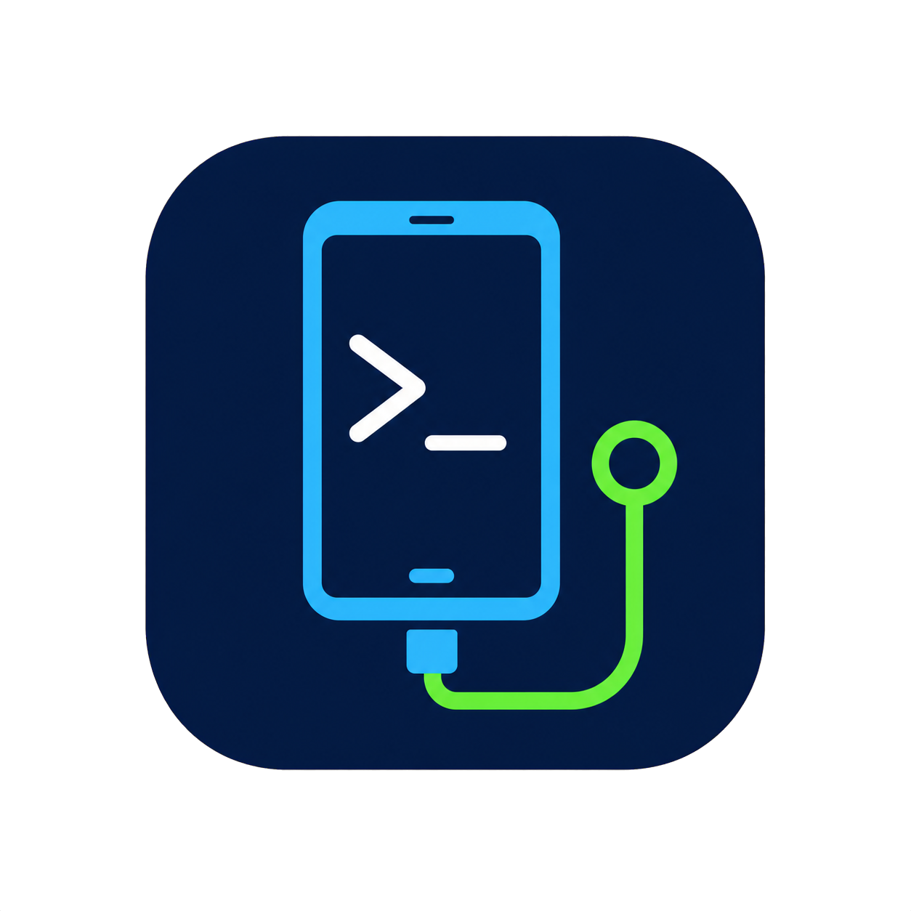

# Android ADB 快速工具

[繁體中文](README.md) · [English](README.en.md)

<p align="center">
  
</p>

<p align="center">
  <a href="LICENSE"></a>
</p>

一套免安裝的 Windows 圖形化 ADB 工具，協助使用者快速確認 Android 裝置連線、批次安裝 APK、調整常用系統設定、擷取畫面與備份手機相片資料。

目前版本：**v2.0.2**

[查看完整更新紀錄](CHANGELOG.md)

## 主要功能

- 檢查 `adb.exe`、USB 偵錯授權、離線與未授權狀態。
- 內建 Wi-Fi 無線偵錯管理，可直接輸入手機 IP、配對 Port、六位數配對碼與偵錯 Port 完成配對、連線及中斷。
- 保存已配對裝置紀錄，支援啟動時自動重新連線、mDNS 區域網路搜尋，以及 ADB 版本與相容性檢查。
- 支援多裝置選擇，顯示型號、序號及 USB／Wi-Fi 標記並記住上次選擇；APK 可同時安裝到全部已連線裝置。
- 建立多組「常用 APK 安裝」清單，一鍵依序安裝並顯示每個 APK 的結果。
- APK 清單欄位過長時，可將滑鼠移到項目上查看完整檔名與完整位置。
- 「我的組合」支援拖曳排序；自訂組合可雙擊直接編輯名稱，排序會自動保存。
- 自動掃描程式旁 `APKs` 目錄中的子資料夾，建立不可誤刪的同步安裝組合。
- 「快速安裝 / 傳輸」提供左右雙拖曳區：左側拖入 APK 立即安裝；右側可選 `Download`、`DCIM`、`Pictures` 或內部儲存根目錄，再拖入檔案或資料夾並保留完整結構。
- 讀取與即時調整手機亮度，支援滑桿、數值及 `+`／`-` 鍵。
- 新增實測 nit 全自動亮度：搭配 ArgyllCMS `spotread` 與外接色度計，以閉迴路反覆量測並調整 Android 亮度至目標值；原有手動模式完整保留。
- 快速設定自動亮度、10 分鐘關屏、最長關屏時間及充電時保持螢幕開啟。
- 各項快速設定獨立執行並讀回驗證；單項失敗不影響其他設定。
- 快速調整媒體音量、在手機開啟網址、擷取手機畫面並儲存 PNG。
- 下載手機 `DCIM`、`Pictures`、`Picture` 內的檔案，保留目錄結構並壓縮成 ZIP。
- 下載前先取得檔案大小，可略過超過自訂上限的單一檔案（預設 2 GB）。
- 支援 Per-Monitor V2 高 DPI、視窗大小記憶與 4K 顯示器縮放。

## 系統需求

- Windows 10 或 Windows 11
- .NET Framework 4.8
- Android Platform Tools 中的 `adb.exe`（Complete 版已內附）
- 手機已開啟「開發人員選項」及「USB 偵錯」或「無線偵錯」

## Wi-Fi 配對與相容性

按主畫面的「Wi-Fi 連線」即可直接管理無線偵錯：

1. Android 11（API 30）以上：在手機的「開發人員選項 > 無線偵錯」選擇使用配對碼配對，將手機顯示的 IP、配對 Port 與六位數配對碼輸入程式並按「開始配對」。
2. 回到手機的無線偵錯主畫面，將「IP 位址與連接埠」中的偵錯 Port 輸入程式，再按「連線」。偵錯 Port 通常與配對 Port 不同。
3. mDNS 搜尋可列出區域網路上的配對與偵錯服務；雙擊搜尋結果可自動帶入對應欄位。
4. 程式可保存裝置紀錄並在下次啟動時執行自動重新連線；若手機重新產生 Port，請更新偵錯 Port。

配對碼功能建議使用最新版 Android SDK Platform-Tools，最低需支援 `adb pair` 的 Platform Tools 30.0.0。Android 10（API 29）以下沒有系統內建配對碼流程，必須先使用 USB 完成偵錯授權，再切換到 `adb tcpip 5555` 後連線。電腦與手機需要位於可互通的同一網路；訪客 Wi-Fi、用戶端隔離、企業防火牆或部分廠牌的系統限制可能讓 mDNS 搜尋或無線連線失敗。

## 取得 Android SDK Platform-Tools

`adb.exe` 包含在 Google 官方的 Android SDK Platform-Tools 中：

- 官方下載頁：[SDK Platform-Tools release notes](https://developer.android.com/tools/releases/platform-tools)
- 進入頁面後選擇 **Download SDK Platform-Tools for Windows**，閱讀並同意條款後下載 ZIP。
- 解壓縮後，`adb.exe` 位於 `platform-tools` 資料夾內；在本工具按「選擇 adb.exe」並指定該檔案即可。
- 若已安裝 Android Studio，也可透過 **SDK Manager > SDK Tools > Android SDK Platform-Tools** 安裝或更新；程式通常會自動找到預設 SDK 位置。

建議使用官方頁面提供的最新版本。Google 表示 Platform-Tools 向下相容舊版 Android，因此一般不需要另外尋找舊版 ADB。

## 下載與使用

GitHub Release 提供兩種壓縮包：

- `AndroidADBTools-v2.0.2.zip`：標準版，只包含 AndroidADBTools；適合已安裝 Android Platform-Tools 或希望自行管理工具版本的使用者。
- `AndroidADBTools-v2.0.2-complete.zip`：Complete 版，額外內含 Android ADB 37.0.0 與 ArgyllCMS 3.5.0 `spotread.exe`，解壓縮後會自動偵測，不必另外指定。

1. 到 [Releases](https://github.com/ahui3c/AndroidADBTools/releases) 選擇需要的 ZIP 並完整解壓縮。
2. 執行 `AndroidADBTools.exe`。
3. 使用標準版且程式沒有找到 ADB 時，按「選擇 adb.exe」並指定 Android SDK 的 `platform-tools\adb.exe`。
4. 連接並授權手機後按「重新檢查」。

程式會依序搜尋：已儲存路徑、程式旁的 `adb.exe`、`platform-tools\adb.exe`、Android SDK 預設位置及系統 `PATH`。

## APK 資料夾同步

可在程式旁建立以下結構：

```text
APKs/
├─ 常用工具/
│  ├─ app1.apk
│  └─ app2.apk
└─ 測試程式/
   └─ test.apk
```

程式啟動時會將每個子資料夾建立為一個安裝組合；點選時會重新掃描 APK 內容。資料夾同步組合會以資料夾圖示標示，名稱與內容直接由檔案系統管理。

## 手機資料下載

- 掃描 `/sdcard/DCIM`、`/sdcard/Pictures` 與 `/sdcard/Picture`。
- 在手機端先建立路徑與大小清單，再依設定決定是否傳輸。
- ZIP 名稱格式為 `手機型號_yyyyMMdd-HHmmss.zip`。
- 大小上限是針對「單一檔案」，不是整個備份的總大小。
- USB 與 Wi-Fi ADB 皆可使用；大型備份建議使用 USB。

## 快速傳輸到手機

- 切換到「快速安裝 / 傳輸」，將檔案或資料夾拖到右側傳輸區。
- 先選擇手機目的地；預設為 `/sdcard/Download/`，也可選 `/sdcard/DCIM/`、`/sdcard/Pictures/` 或內部儲存根目錄 `/sdcard/`。
- 放開後會自動傳輸到目前選擇的目的地。
- 拖入資料夾時會保留最外層資料夾名稱及所有子目錄結構。
- 每個拖入項目會分別處理；單項失敗不會中止其餘傳輸，詳細結果可在「執行紀錄」查看。

## 實測 nit 全自動亮度

「亮度調整」頁上方保留原本的手動滑桿、數值與鍵盤控制；下方新增外接色度計閉迴路校準：

1. Complete 版已內附 ArgyllCMS 3.5.0 `spotread.exe`；標準版請從 [ArgyllCMS 官方網站](https://www.argyllcms.com/) 下載 Windows 版本，再於程式選擇 `bin\spotread.exe`。
2. 連接手機與 ArgyllCMS 相容的顯示器量測設備，將感測面貼平手機畫面中央。
3. 按「手機開啟白色測試圖」，並確認圖片檢視器為全螢幕、沒有工具列或通知遮擋。
4. 先按「設備測試」。成功取得絕對發光量測的 Y 值後，輸入目標（例如 200 nit）與允許誤差，再開始全自動調整。
5. 程式會關閉 Android 自動亮度、反覆設定亮度、等待畫面穩定並呼叫 `spotread -e -O`；達標後保留最接近目標的 Android 亮度值。

可選擇 `.ccss`／`.ccmx` 顯示器修正檔，以改善特定 OLED／LCD 光譜與色度計的配對誤差。此功能只調整白畫面的實測亮度，不等同完整色彩校正、ICC 校正或 HDR／高亮度模式控制。目標若超過手機當下可達亮度，程式會套用量測到的最接近結果並說明誤差。

### spotread 相容量測設備

以下為 ArgyllCMS 官方清單中較常見、可用於顯示器發光量測的系列，並非完整名單：

| 品牌／類型 | 常見相容機型 |
| --- | --- |
| Calibrite／X-Rite 色度計 | ColorChecker Display／Pro／Plus、i1Display Pro／Pro Plus、ColorMunki Display、i1Display Studio |
| X-Rite 光譜儀 | ColorMunki Design／Photo、i1Studio、ColorChecker Studio、i1Pro2、i1Pro3／Pro3 Plus |
| Datacolor | Spyder 3／4／5、SpyderX、SpyderX2、Spyder／SpyderPRO（2024） |
| 專業與其他設備 | Klein K10-A、JETI specbos／spectraval、ColorHug／ColorHug2、DTP94、Eye-One Display、Huey、HCFR |

程式內也可按「相容量測設備」查看摘要。完整型號、能力與個別安裝需求請參考 [ArgyllCMS 官方支援設備清單](https://www.argyllcms.com/doc/instruments.html)及 [Windows 儀器安裝說明](https://www.argyllcms.com/doc/Installing_MSWindows.html)。部分設備需要原廠韌體、校正資料或額外驅動；實際是否可用仍以「設備測試」能否由 `spotread` 正確辨識並回傳讀值為準。若失敗，請關閉可能占用儀器的校色或 RGB 燈效軟體，並檢查驅動與 USB 連線。

## 從原始碼建置

在 PowerShell 執行：

```powershell
powershell -ExecutionPolicy Bypass -File .\Build.ps1
```

輸出檔案位於 `dist\AndroidADBTools.exe`。建置腳本使用 Windows 內建的 .NET Framework C# 編譯器，不需要另外安裝 .NET SDK。

## 設定儲存位置

使用者設定儲存在：

```text
%LOCALAPPDATA%\AndroidADBTools\settings.json
```

內容包含 ADB 路徑、上次操作裝置、Wi-Fi 裝置紀錄與自動重連設定、是否將 APK 安裝到全部裝置、APK 組合、組合順序、視窗大小、下載位置與檔案大小過濾設定，以及 `spotread`／修正檔路徑、目標 nit 與容許誤差。

## 授權

從 **v1.16.0** 起，本專案依 [GNU Affero General Public License v3.0](LICENSE) 授權，SPDX 識別碼為 `AGPL-3.0-only`。你可以使用、研究、修改與散布本程式，但散布修改版或提供符合 AGPL 網路互動條件的版本時，必須依授權條款提供完整對應原始碼。

已經發布的 **v1.15.6 與更早版本仍維持原有 MIT License**；授權變更不會撤回使用者已取得的 MIT 權利。舊版 MIT 文字另存於 [LICENSE-MIT-LEGACY](LICENSE-MIT-LEGACY)，僅供歷史版本對照。

本程式按「現狀」提供，不附帶任何明示或默示擔保。完整條款以 [LICENSE](LICENSE) 為準。

Complete 版額外包含 Apache License 2.0 的 Android ADB 元件，以及 GNU AGPLv3 的 ArgyllCMS `spotread.exe`。版本、來源、授權文件與對應原始碼資訊請見 [THIRD_PARTY_NOTICES.md](THIRD_PARTY_NOTICES.md)；標準版不包含這些第三方執行檔。

## 作者

- 廖阿輝
- 郵件：[chehui@gmail.com](mailto:chehui@gmail.com)
- 網站：[https://ahui3c.com](https://ahui3c.com)
