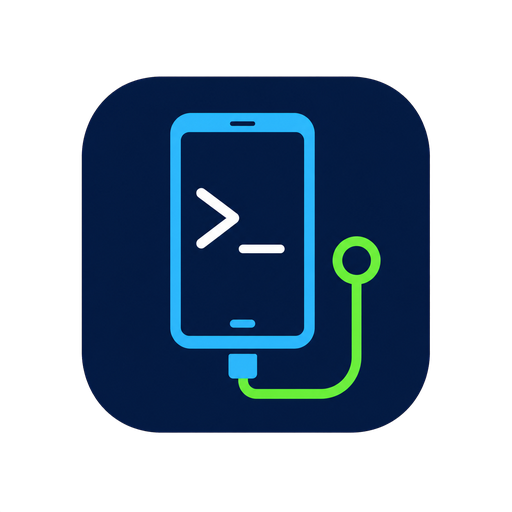
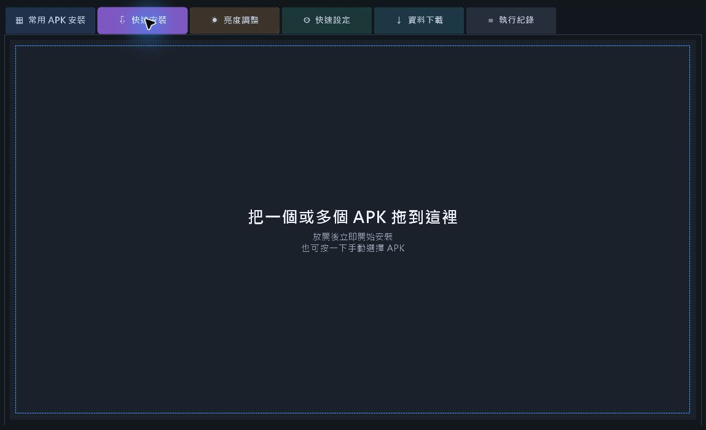
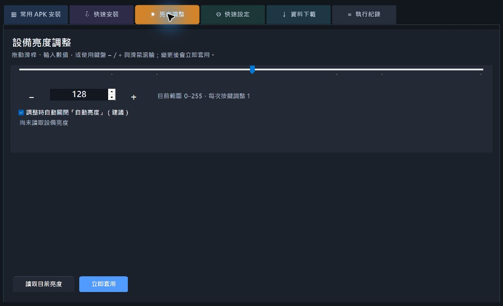
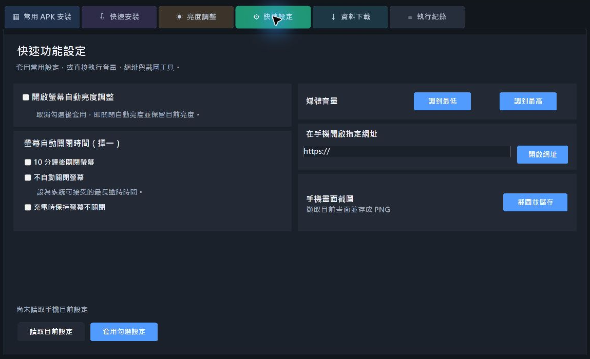
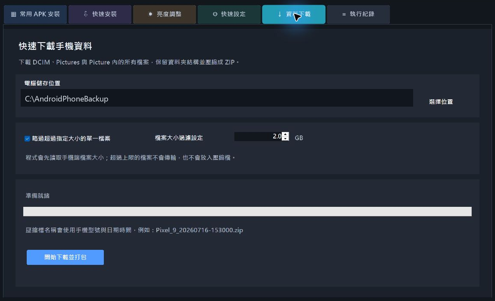

# Android ADB 快速工具：免背指令完成 APK 批次安裝、亮度控制、截圖與相片備份



對 Android 測試人員、App 開發者，或經常要初始化多台手機的人來說，ADB 是非常實用的工具；但檢查連線、安裝一批 APK、修改亮度與螢幕逾時、截圖或備份相片，往往得反覆輸入不同指令。

我把這些常用流程整理成一套 Windows 圖形化工具——**Android ADB 快速工具**。它不需要安裝，開啟單一執行檔、指定 Google 官方的 `adb.exe`，就能用滑鼠完成多數日常工作；需要大量部署 APK 時，也能直接拖放檔案或建立可重複使用的安裝組合。

目前版本為 **v1.16.0**，專案原始碼與 Windows 執行檔皆已公開在 GitHub。

> **下載最新版：** [AndroidADBTools Releases](https://github.com/ahui3c/AndroidADBTools/releases)<br>
> **原始碼：** [github.com/ahui3c/AndroidADBTools](https://github.com/ahui3c/AndroidADBTools)

## 這套工具可以做什麼？

Android ADB 快速工具目前整合了以下功能：

- 檢查 `adb.exe`、手機連線、USB 偵錯授權、離線及未授權狀態。
- 支援 USB 連線與 Wi-Fi 無線偵錯，並內建可反白複製的完整教學。
- 建立多組「常用 APK 安裝」清單，一次依序安裝整組 App。
- 掃描程式旁 `APKs` 資料夾，自動建立與資料夾同步的 APK 組合。
- 把一個或多個 APK 拖進視窗後立即安裝。
- 讀取並即時調整手機亮度，支援滑桿、數字、鍵盤及滑鼠滾輪。
- 快速設定自動亮度、螢幕關閉時間、充電時保持亮屏及媒體音量。
- 在手機開啟指定網址，以及把目前手機畫面擷取為 PNG。
- 下載 `DCIM`、`Pictures`、`Picture` 內的資料並保留目錄結構，最後打包成 ZIP。
- 下載前先取得手機端檔案大小，略過超過指定上限的單一檔案。
- 支援 Per-Monitor V2 高 DPI、4K 縮放與視窗大小記憶。

整套程式在電腦本機執行，不需要帳號，也不會把手機內容上傳到雲端。

## 使用前要準備什麼？

電腦端需要：

- Windows 10 或 Windows 11
- .NET Framework 4.8
- Google Android SDK Platform-Tools 內的 `adb.exe`

手機端則要開啟「開發人員選項」，並依連線方式開啟「USB 偵錯」或「無線偵錯」。不同品牌的選單名稱可能稍有差異，常見的開啟方式是進入「設定 → 關於手機」，連續點擊版本號碼七次，再回到系統設定內尋找開發人員選項。

### Android Platform-Tools 要去哪裡下載？

請從 Google 官方頁面取得最新版：

**[下載 Android SDK Platform-Tools](https://developer.android.com/tools/releases/platform-tools)**

進入頁面後選擇 **Download SDK Platform-Tools for Windows**，同意條款並下載 ZIP。解壓縮後，`adb.exe` 就在 `platform-tools` 資料夾內。回到 Android ADB 快速工具按下「選擇 adb.exe」，指定這個檔案即可。

如果電腦已安裝 Android Studio，也可從 **SDK Manager → SDK Tools → Android SDK Platform-Tools** 安裝或更新。程式也會嘗試從常見的 Android SDK 位置、程式旁資料夾及系統 `PATH` 自動尋找 ADB。

> 建議只從 Google 官方頁面下載 Platform-Tools，不要使用來源不明的 ADB 壓縮包。

## 先確認手機是否正確連線

啟動程式後，最上方會顯示 ADB 與手機狀態。若手機已解鎖、USB 傳輸線可傳輸資料，並在手機的「允許 USB 偵錯嗎？」視窗按下允許，程式就會顯示手機型號與序號。

若沒有連上，可以依序檢查：

1. USB 線是否支援資料傳輸，而不是只有充電。
2. 手機是否已開啟 USB 偵錯。
3. 手機畫面是否出現 RSA 授權詢問，而且已按下允許。
4. 裝置管理員內是否缺少手機廠商的 USB 驅動程式。
5. 按下程式的「重新檢查」，重新取得目前裝置狀態。

程式內的「連線教學」分成 USB 與 Wi-Fi 兩頁，內容可直接反白並以 `Ctrl+C` 複製，遇到新手機時不必另外查指令。

## 常用 APK 安裝：把一整套 App 變成一個按鈕

需要測試新手機或替多台設備安裝固定工具時，可以建立多個 APK 組合。例如建立「效能測試」、「Google 工具」及「展示用 App」，每組加入不同的 APK，之後選取組合並按「全部安裝」即可。

自訂組合可以：

- 新增、重新命名與刪除。
- 使用上移、下移調整顯示順序，程式會記住排序。
- 按「加入 APK」選擇檔案。
- 直接把 APK 拖到右側清單加入。
- 移除選取項目，或允許降版安裝。
- 逐一顯示等待、安裝中、成功或失敗狀態。

### 用資料夾自動建立 APK 組合

如果 APK 本來就依用途存放在資料夾，也不必在介面中重建一次。只要在程式旁建立以下結構：

```text
APKs/
├─ 常用工具/
│  ├─ app1.apk
│  └─ app2.apk
└─ 測試程式/
   └─ benchmark.apk
```

程式啟動時會把每個子資料夾建立成一個組合；每次點選時都會重新掃描其中的 APK。這類組合會以資料夾圖示及「資料夾同步」文字標示，名稱和內容由檔案系統管理，因此介面不提供重新命名與刪除，以免誤刪實體資料。

## 快速安裝：APK 拖進去就開始

若只是臨時安裝一、兩個 APK，不必先建立組合。切換到「快速安裝」，將一個或多個 `.apk` 檔拖進大面積拖放區，放開滑鼠後程式就會立即開始安裝；也可以直接點一下拖放區選擇檔案。



這種設計特別適合剛編譯完成 App，想快速丟進實機驗證的情境。安裝結果會寫入「執行紀錄」，若 Android 回傳簽章不符、版本降級或空間不足，也能從紀錄判斷原因。

## 亮度調整：滑桿、鍵盤、滾輪都能用

Android 裝置的亮度上限不一定都是 255。有些品牌或系統版本可能採用更高的內部數值，因此工具會先嘗試讀取設備回報的亮度上限，再依實際範圍調整滑桿，而不是把所有手機硬性限制在 0～255。



可用的操作方式包括：

- 拖曳滑桿。
- 在數值欄直接輸入。
- 點擊畫面上的 `－`、`＋`。
- 在亮度頁按實體鍵盤的 `-`、`+`。
- 將滑鼠移到亮度頁後滾動滾輪。

按鍵與滾輪每次都調整 **1**，變更後會立即透過 ADB 套用。若勾選「調整時自動關閉自動亮度」，程式會先切換為手動亮度，避免系統感光機制馬上把數值改回去。

> 不同品牌可能限制透過 ADB 寫入部分系統設定；如果套用失敗，可到「執行紀錄」查看手機回傳內容。

## 快速設定：常用開關集中在同一頁

「快速設定」把幾個測試時常用的操作放在同一頁：



- 開啟或關閉螢幕自動亮度。
- 將螢幕關閉時間設為 10 分鐘，或設為系統可接受的最長逾時時間。
- 設定充電時保持螢幕不關閉。
- 將媒體音量快速調到最低或最高。
- 輸入網址並在手機上開啟。
- 擷取目前手機畫面並儲存為 PNG。

按「讀取目前設定」可取得手機現況；按「套用勾選設定」時，各項設定會**獨立執行並讀回驗證**。其中一項失敗不會中止後面的項目，完成後會列出成功與失敗的設定名稱，詳細輸出則保留在執行紀錄中。

請注意，「不自動關閉螢幕」實際上是設定為 Android 系統可接受的最長逾時值，個別品牌仍可能受到省電模式、企業管理政策或系統客製化限制。充電保持亮屏是另一個獨立選項，僅在充電期間生效。

## 資料下載：相片與截圖自動整理成 ZIP

「資料下載」適合在換機、測試結束或交付設備前，快速收集手機中的相片與截圖。程式會掃描：

- `/sdcard/DCIM`
- `/sdcard/Pictures`
- `/sdcard/Picture`



程式會先在手機端建立檔案路徑與大小清單，再逐一下載符合條件的檔案，保留原本的資料夾結構，最後壓縮成：

```text
手機型號_yyyyMMdd-HHmmss.zip
```

「檔案大小過濾設定」是針對**單一檔案**，不是整包資料的容量。預設勾選並略過超過 **2 GB** 的單一檔案，使用者可自行調整 GB 數值；下載位置、是否啟用過濾及上限都會保存，下次開啟程式會沿用。

這個設計能避免大型影片拖慢整批備份，或因連線中斷讓前面的下載前功盡棄。USB 與 Wi-Fi ADB 都能使用，但大量相片或影片仍建議接 USB，速度與穩定度通常較好。

## Wi-Fi 無線偵錯能使用全部功能嗎？

可以。只要裝置已透過 `adb connect` 正常出現在 ADB 清單中，APK 安裝、亮度與快速設定、開啟網址、截圖及資料下載都會對目前選取的裝置執行。

Android 11 以上可在開發人員選項使用「無線偵錯」與配對碼；較舊版本通常要先以 USB 完成偵錯授權，再執行 `adb tcpip 5555` 與 `adb connect 手機IP:5555`。手機與電腦應位於可互通的同一網路。

無線連線也有幾點要留意：

- 手機重新開機、切換網路，或 IP／Port 改變後，可能需要重新連線。
- 公用 Wi-Fi、訪客網路及路由器的用戶端隔離可能阻止裝置互通。
- 大型 APK 與大量檔案傳輸會受 Wi-Fi 品質影響。
- 使用完畢後建議關閉無線偵錯，避免裝置長時間開放偵錯連線。

## 高 DPI 與視窗大小記憶

程式支援 Windows Per-Monitor V2 高 DPI，改善 4K 顯示器及系統放大顯示時的文字鋸齒。介面會以合理的最小尺寸開啟；使用者手動調整視窗後，寬度、高度及狀態會自動保存，下次執行時恢復上次大小。

設定檔位於：

```text
%LOCALAPPDATA%\AndroidADBTools\settings.json
```

其中包含 ADB 路徑、自訂 APK 組合與排序、視窗大小、資料下載位置及檔案大小過濾設定。要將程式搬到另一台電腦時，APK 資料夾同步組合可直接隨程式複製；自訂清單若引用原電腦的絕對路徑，則需要重新指定檔案。

## 從原始碼自行建置

專案採用 C# Windows Forms 與 .NET Framework 4.8。下載或 Clone 原始碼後，在專案根目錄開啟 PowerShell，執行：

```powershell
powershell -ExecutionPolicy Bypass -File .\Build.ps1
```

完成後的執行檔位於：

```text
dist\AndroidADBTools.exe
```

建置腳本使用 Windows 內建的 .NET Framework C# 編譯器，不必另外安裝 .NET SDK。

## 使用安全提醒

ADB 擁有安裝 App、讀取共享儲存空間及修改部分系統設定的能力，請只連接自己擁有或已獲授權管理的裝置。

- APK 請從可信來源取得，安裝前確認簽章與版本。
- 不要在陌生電腦上永久允許 USB 偵錯。
- 使用完畢後，可關閉 USB／Wi-Fi 偵錯，或撤銷 USB 偵錯授權。
- 備份壓縮檔可能包含照片、截圖及個人資訊，完成後請妥善保存。
- 公司管控設備或部分客製化系統可能禁止某些 ADB 指令，這不代表其他功能也無法使用。

## 常見問題

### 程式顯示「找不到已連線的手機」怎麼辦？

先解鎖手機並確認 USB 偵錯已開啟，再檢查手機是否跳出授權詢問。若狀態是 `unauthorized`，可撤銷手機上的 USB 偵錯授權、重新插線後再次允許。若 ADB 看得到裝置但狀態是 `offline`，可重新啟動 ADB 或重插 USB。

### 亮度一定是 0～255 嗎？

不一定。程式會嘗試從 Android 資源與系統資訊偵測上限；若目前亮度已高於偵測值，也會擴大有效範圍，以避免把高亮度設備錯誤壓回 255。

### APK 安裝失敗會看得到原因嗎？

會。清單會顯示個別 APK 狀態，完整的 ADB 回傳訊息則寫入執行紀錄。常見原因包括版本降級、簽章不一致、儲存空間不足，以及 APK 與裝置架構或 Android 版本不相容。

### 資料下載會把整支手機備份嗎？

不會。此功能專注於 `DCIM`、`Pictures`、`Picture` 三個共享儲存資料夾，不會備份 App 私有資料、聊天紀錄或整個 Android 系統。

### 工具會把手機資料上傳到網路嗎？

不會。程式透過本機 `adb.exe` 與裝置溝通，下載內容直接寫入使用者指定的電腦資料夾；GitHub 僅用來提供原始碼與程式下載。

## 下載與專案資訊

- **最新版下載：** [GitHub Releases](https://github.com/ahui3c/AndroidADBTools/releases)
- **原始碼與問題回報：** [AndroidADBTools GitHub Repository](https://github.com/ahui3c/AndroidADBTools)
- **Android Platform-Tools：** [Google 官方下載頁](https://developer.android.com/tools/releases/platform-tools)
- **目前版本：** v1.16.0
- **授權：** GNU Affero General Public License v3.0（AGPL-3.0-only）

從 v1.16.0 起，專案改採 AGPLv3；v1.15.6 與更早已發布版本仍維持原有 MIT License。使用、修改或散布前，請閱讀 GitHub 專案中的完整授權條款。

如果你經常替 Android 手機安裝測試工具、調整顯示設定、截圖或整理相片，Android ADB 快速工具可以把原本散落在命令提示字元裡的操作，變成一套可看、可點、可重複使用的工作流程。

---

## 作者

**廖阿輝**<br>
郵件：[chehui@gmail.com](mailto:chehui@gmail.com)<br>
網站：[https://ahui3c.com](https://ahui3c.com)
